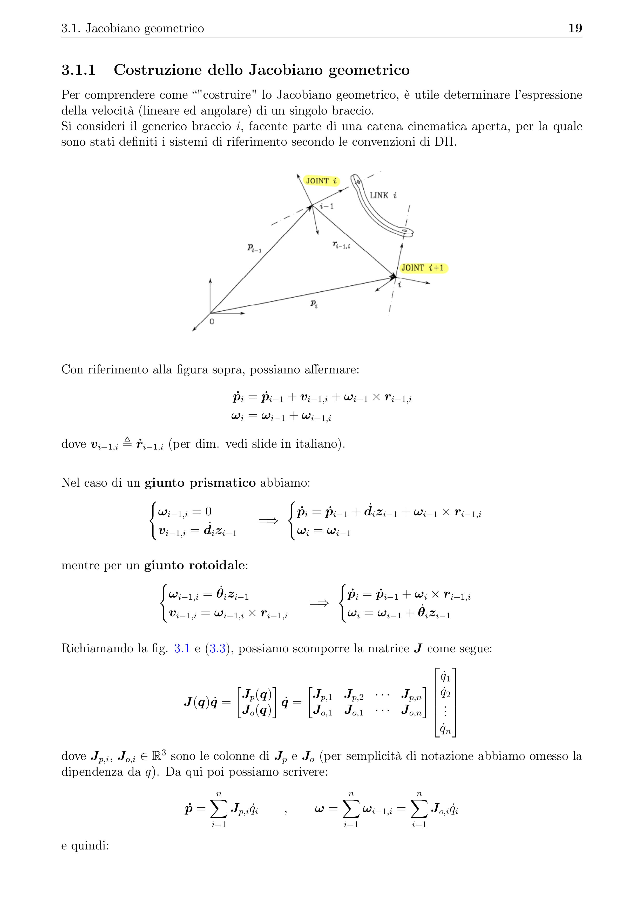

# LaTex Template

## 1. Modify `config.toml` and generate `main.tex`

First set your data in the config file:
```toml
title = "YOUR TITLE"
author = "YOUR NAME"

# true if you want to use appendix, false otherwise
appendix = true

academic_year = "2023/2024"

language = "english"
```
Then, run `init.py` to create the `main.tex` with the specified data.

## 2. Start writing you chapters 

You can now start writing new chapters by creating new files under the `chapter` folder and adding
```tex
\input{chapters\your_filename}
```
in `main.tex`, where specified

*p.s. all the images should be put under the `images` folder*


## Example

You can see an example of this template in my [*ROBOTICS* lecture notes](https://github.com/regi18/Robotics_LectureNotes/blob/master/main.pdf)


